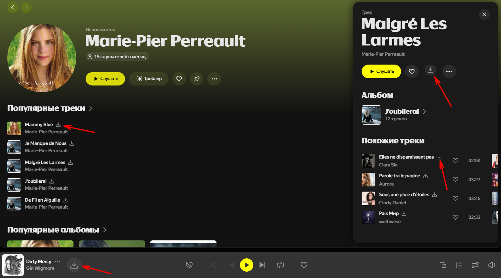
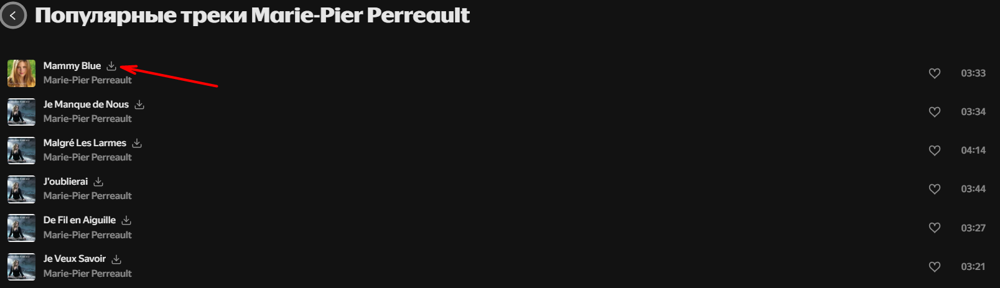

# 🎵 Yandex Music Downloader PRO

**Мощное, стабильное и умное расширение для скачивания музыки с Яндекс Музыки в браузере Google Chrome.**

https://github.com/user-attachments/assets/8b84df4b-2e6b-4391-bd14-baeb8e463669

*Наслаждайтесь любимыми треками офлайн в максимальном качестве.*

---

## 🚀 Главные преимущества расширения

YaMusic Downloader PRO спроектирован с учетом сложной современной архитектуры Яндекс Музыки (актуальный интерфейс 2026 года). Благодаря глубокой интеграции с внутренним плеером, расширение обеспечивает высокую стабильность: оно точно определяет играющую композицию и скачивает **именно текущий трек**, исключая частую ошибку с загрузкой фоновых "прелоадов" (следующих песен) — особенно при прослушивании на главной странице сервиса.

* **🎨 Премиальный мини-плеер (Popup):** Управляйте музыкой, не переходя на вкладку Яндекса! Элегантный интерфейс с эффектом матового стекла позволяет переключать треки, ставить лайки (с мгновенной синхронизацией) и скачивать музыку в один клик. Все соавторы трека отображаются полностью, без сокращений.
* **🧠 Умный алгоритм перехвата:** Безупречная работа везде — от личных плейлистов до бесконечного потока «Моей Волны» на главной странице.
* **🏷️ Идеальные имена файлов:** Никаких обрезанных названий. Треки сохраняются в аккуратном формате `Исполнитель 1, Исполнитель 2 - Название трека.mp3`, получая информацию напрямую из оригинальной базы сервиса.
* **⚙️ Безопасная нативная работа:** Управление воспроизведением и лайками происходит естественным для браузера путем. Это гарантирует, что алгоритмы Яндекса будут корректно учитывать ваши предпочтения без сбоев.

## ✨ Основной функционал

* 📥 **Скачивание в 1 клик** из любого места:
  * В списках треков (плейлисты, альбомы, профили артистов)
  * В нижней панели глобального плеера
  * В правой боковой информационной панели
  * В плеере «Моя Волна» на главной странице
* 🎵 Автоматический выбор **максимального качества MP3 (до 320 kbps)**.
* 🎛️ **Полноценный мини-плеер:** Управляйте музыкой, ставьте лайки и переключайте треки, не переходя на вкладку Яндекса.
* 📁 **Умная маршрутизация:** Возможность скачивать музыку в отдельную подпапку (например, `Загрузки/Music`).

---

## 📦 Инструкция по установке

Расширение обладает продвинутым техническим функционалом и устанавливается в режиме разработчика. Это занимает ровно 1 минуту.

> ⚠️ **ОЧЕНЬ ВАЖНО:** Распакуйте скачанный архив в надёжное постоянное место (например, в папку `Документы/YaMusicDownloader` или на диск `D:\`), **откуда вы не будете его удалять**. Chrome читает файлы прямо из вашей папки. Если вы удалите её — расширение перестанет работать!

1. Перейдите в раздел **[Releases](../../releases)** и скачайте архив `yamusic-downloader-pro.zip`.
2. **Распакуйте архив** в безопасную папку (см. предупреждение выше).
3. Откройте Google Chrome и введите в адресную строку: `chrome://extensions/`
4. В правом верхнем углу включите тумблер **«Режим разработчика»** (Developer mode).
5. Нажмите кнопку **«Загрузить распакованное расширение»** (Load unpacked) в левом верхнем углу.
6. Выберите папку, в которую вы распаковали архив.
7. 🎉 **Готово!** Расширение установлено. Нажмите на иконку «Пазла» 🧩 (Расширения) в правом верхнем углу Chrome и нажмите на иконку «Скрепки» 📌 рядом с YaMusic Downloader PRO, чтобы закрепить его на панели. После этого откройте Яндекс Музыку и **нажмите F5** для обновления страницы.

---

## ⚙️ Настройки папки загрузок

Вы можете настроить папку, куда будут сохраняться скачанные MP3:
1. Нажмите правой кнопкой мыши по иконке расширения.
2. Выберите **«Параметры»**.
3. Укажите желаемое имя подпапки (например: `1_Music`) или оставьте поле пустым, чтобы треки летели прямо в корень папки загрузок вашего браузера.

---

## 📸 Галерея интерфейса

### Глобальная интеграция (Нижний плеер, боковая панель и списки)

### Кнопки везде, где они нужны
| Плеер «Моя Волна» | Очередь воспроизведения |
|:---:|:---:|
|  |  |

| Страница Артиста | Страница Альбома |
|:---:|:---:|
|  |  |

---

## 🙏 Благодарности

В мире Open Source мы стоим на плечах гигантов. Отдельное спасибо авторам этих замечательных проектов, которые послужили вдохновением и базой знаний:
* [PaulZtx/ya-music-downloader-extension](https://github.com/PaulZtx/ya-music-downloader-extension) — за начальную идею и отправную точку.
* [MarshalX/yandex-music-api](https://github.com/MarshalX/yandex-music-api) — за великолепный реверс-инжиниринг и документацию неофициального API Яндекса.

---

## ⚖️ Правовая информация и Дисклеймер

Данное программное обеспечение (YaMusic Downloader PRO) разработано исключительно в **образовательных исследовательских целях** и предназначено для **личного использования**.

1. Расширение функционирует **только при наличии активной оплаченной подписки** пользователя на сервис Яндекс Музыка. Оно не обходит защиту от неоплаченного доступа (paywall).
2. Разработчик расширения **не несет ответственности** за любые прямые или косвенные последствия использования данного ПО. Вся ответственность за использование скачанных материалов лежит на конечном пользователе.
3. Категорически запрещается использовать данное расширение для пиратства, коммерческого распространения или нарушения авторских прав создателей музыкальных произведений. Сохраненные файлы предназначены исключительно для локального офлайн-прослушивания владельцем подписки.

---

## ☕ Поддержать автора

Проект разрабатывается и поддерживается в свободное время. Адаптация расширения под новые обновления интерфейса Яндекса требует регулярного тестирования и отладки кода. 

Если утилита оказалась для вас полезной, работает стабильно и просто делает прослушивание любимой музыки чуточку комфортнее, вы можете сказать автору "спасибо" чашкой виртуального кофе:

👉 **[Поддержать проект на CloudTips (Карты РФ, СБП, T-Pay)](https://pay.cloudtips.ru/p/5647818e)**

*Любая поддержка невероятно мотивирует выпускать обновления быстрее и добавлять новые фичи! Огромное спасибо всем, кто поддерживает Open-Source! 🚀*

---

<i>Сделано с фокусом на качество кода и любовь к хорошей музыке.</i>

